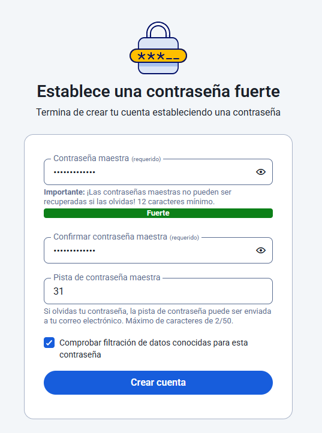
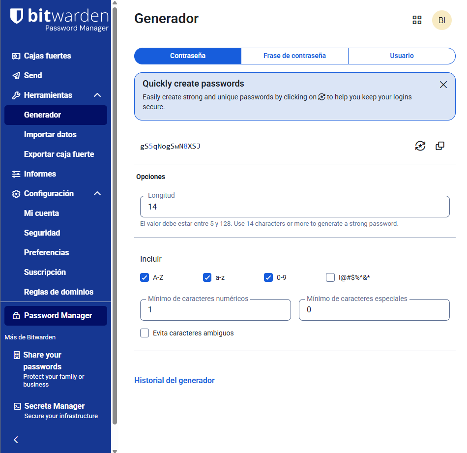
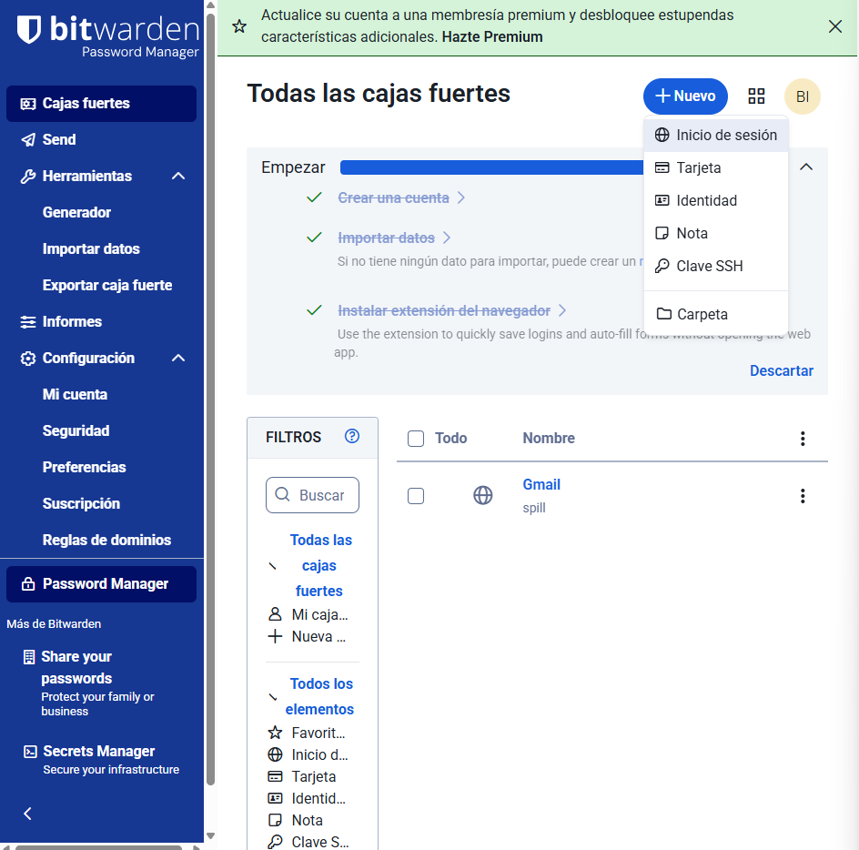
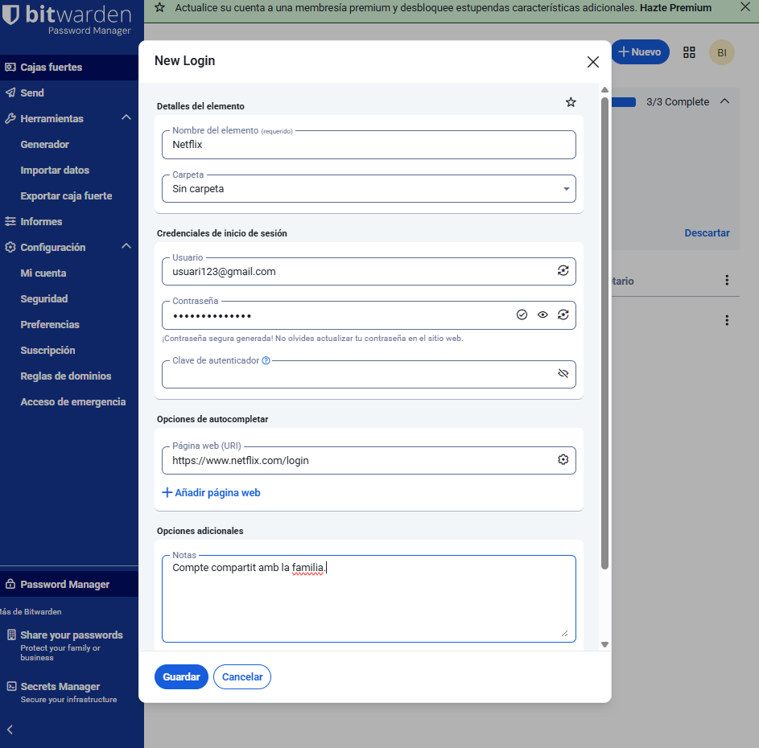
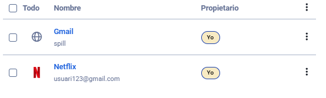
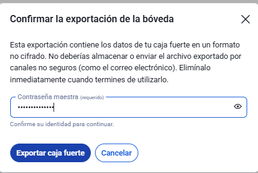

# T01: Gestor de contrasenyes

## Fase 1: Anàlisi i Justificació

### Introducció i Justificació
Explicació de per què les contrasenyes febles o reutilitzades són un risc crític per a l'empresa (atac de diccionari, credential stuffing, etc.).

Les contrasenyes febles o reutilitzades representen un risc molt alt per a qualsevol empresa. Quan una contrasenya és fàcil d’endevinar pot ser descoberta fàcilment amb atacs de diccionari, on proven combinacions.  
Si els treballadors utilitzen la mateixa contrasenya en molts llocs, poden arribar a sufrir un atac de **credential surfing** que pot permetre als delinqüents accedir a totes les comptes.

### La funció crucial d'un gestor de contrasenyes per mitigar aquests riscos
La funció d’un gestor de contrasenyes pot salvar moltes vegades la nostra informació, per això seguim els següents passos:

- Genera claus segures i úniques.  
- Les emmagatzema de forma xifrada.  
- Facilita l’accés segur als serveis sense haver de recordar-les totes.

---

### Comparativa Tècnica
Realitzeu una taula comparativa detallada entre:

- **Bitwarden (Alternativa Online / Núvol)**  
  Analitzeu la sincronització, el model de seguretat (xifratge end-to-end), la facilitat d'accés des de múltiples dispositius i el cost/model freemium.

- **KeePassX / KeePassXC (Alternativa Offline / Escriptori)**  
  Analitzeu l'emmagatzematge local de l'arxiu (KDBX), la independència del núvol, el model open source i la portabilitat de l'arxiu.

#### Comparativa tècnica

| Característica        | Bitwarden                                           | KeePassXC                                                  |
|------------------------|-----------------------------------------------------|-------------------------------------------------------------|
| **Sincronització**     | Automàtica entre dispositius mitjançant núvol       | No sincronitza automàticament, cal copiar l’arxiu manualment |
| **Model de seguretat** | Xifratge end-to-end                                 | Xifratge local fort en un fitxer KDBX                        |
| **Accés multi-dispositiu** | Accés fàcil des de web, mòbil i aplicació d’escriptori | Limitat al dispositiu on es guarda el fitxer                 |
| **Model de cost**      | Freemium (gratuït i opció de compra)                | Gratuït i open source                                       |
| **Dependència del núvol** | Sí, depèn dels servidors de Bitwarden             | No depèn d’Internet ni de cap servidor extern               |
| **Codi obert**         | Sí                                                  | Sí                                                          |
| **Portabilitat**       | Alta                                                | Alta                                                        |

---

### Avantatges i Inconvenients
Resumiu els principals pros i contres de cada model (online vs. offline) des del punt de vista de seguretat, usabilitat i continuïtat del negoci.

| Aspecte              | Bitwarden (Online)                                 | KeePass (Offline)                                         |
|----------------------|----------------------------------------------------|-----------------------------------------------------------|
| **Seguretat**        | Molt bona, però depèn del núvol                    | Molt alta, ja que no hi ha connexió externa               |
| **Usabilitat**       | Molt fàcil d’usar, sincronitza automàticament      | Més tècnic i manual                                       |
| **Continuïtat del negoci** | En cas de pèrdua d’un dispositiu, la informació segueix en el núvol | Si es perd o corromp l’arxiu KDBX, es pot perdre tot      |
| **Privacitat**       | Les dades estan xifrades, però allotjades en servidors externs | Total control local de les dades                          |

---

### Recomanació
Concloeu l'informe escollint l'eina que considereu més adequada per al personal tècnic de l'empresa i justifiqueu la vostra elecció.

Per a una empresa amb personal tècnic, la millor opció és **Bitwarden**.  
Tot i que **KeePassXC** ofereix més control i independència, Bitwarden combina:

- Seguretat forta amb xifratge end-to-end.  
- Sincronització automàtica entre dispositius.  
- Facilitat d’ús i gestió centralitzada.

Això redueix errors humans i millora la gestió de contrasenyes dins de l’empresa.  
El seu model open source i el xifratge complet garanteixen confiança, privacitat i continuïtat del negoci.

---

## Fase 2: Guia d'Ús Tècnica

### Instal·lació i Configuració Inicial
Descàrrega, instal·lació i creació de la BBDD principal o compte mestre.

A la web de Bitwarden, descarregarem l’extensió.

Crearem un compte si no en tenim.

Configurarem la contrasenya mestre. Haurem de donar un indici sobre la contrasenya.

Un cop configurat, obrim l’extensió o la web.

---

### Generació de Contrasenyes Segures
Explicació de com utilitzar el generador de contrasenyes de l'eina (paràmetres, longitud, caràcters especials).

A l’entrar, anem a les eines i anem a l’apartat on posa **“generador”**.  
Aquest apartat serveix per crear contrasenyes automàticament. Podem modificar com la volem seleccionant la longitud que volguem, si volem lletres majúscules, minúscules, números o símbols.  
També ens ofereix un historial de les anteriors contrasenyes generades, contrasenyes de més d’una paraula o contrasenyes específiques per al que vulguem.

---

### Exemples d'Ús i Emplenament Automàtic

#### Com desar una credencial d'un compte de correu electrònic

Per desar una credencial d’un compte de correu electrònic, obrirem Bitwarden i anirem a “cajas fuertes”.  
Després, crearem un nou element on es mostra a la captura.

A dins, omplim els apartats que ens demana. Posarem el nom que vulguem tenir al correu, la carpeta on vulguem guardar la contrasenya, després el nostre usuari i la contrasenya.  
Tenim l’opció de generar les dues últimes automàticament si no sabem què posar o volem que la contrasenya sigui més segura.

Al crear-ho, tenim opció d’editar-ho o eliminar la nova contrasenya.

Comprovem que ens apareix a la llista de passwords.

---

#### Com desar una credencial d'una aplicació o servei web

Per guardar una credencial de qualsevol lloc web, anirem a la caixa forta i pulsarem “nuevo” després “Inicio de sesión”.

En el meu cas ho faré com si fos el meu compte de Netflix, però és un exemple.

Ens hauria d’aparèixer un cop creada a la llista, junt amb la anteriorment creada.

---

#### Com fer servir l’extensió del navegador per emplenar automàticament les dades

Per utilitzar l’extensió automàticament en qualsevol web, primer de tot, l’haurem de tindre activa l’extensió i iniciada la sessió amb el compte on tenim totes les contrasenyes guardades.

Després, obrirem per exemple el Netflix, on ja hem guardat una contrasenya.

Quan obrim la web, automàticament ens mostrarà l’opció d’omplir la informació.

Un cop seleccionem l’usuari, Bitwarden emplenarà automàticament el formulari d’inici de sessió.

---

### Gestió de Còpies de Seguretat (Backup)

Explicació detallada de com fer una còpia de seguretat de l'arxiu de contrasenyes (**KDBX** en KeePass o **Exportació** en Bitwarden).

Per fer una còpia de seguretat, haurem d’anar a Bitwarden → Eines → Exportar caixa forta.  
Podem elegir el format que volem exportar-ho, en el meu cas ho faré amb **.json**.

Al exportar-ho, ens demanarà la contrasenya mestre i seleccionem **“exportar caja fuerte”**.

---

### Recomanació de la millor pràctica per emmagatzemar la còpia
Per últim, aquest arxiu el podem guardar en el nostre **USB** o en qualsevol emmagatzematge al núvol (per exemple, Google Drive), per no perdre-ho.

