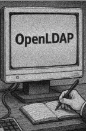

# T04: Serveis de directori. LDAP

## Breu descripció

**Innovatech**, una start-up tecnològica emergent, està experimentant un ràpid creixement i pateix un caos en la gestió dels seus usuaris i accessos.

Actualment, cada servei intern (servidor de fitxers, wiki de documentació, etc.) utilitza la seva pròpia base de dades d'usuaris i contrasenyes i, a més, als ordinadors clients s’usa autentificació local.  
Això genera diversos problemes crítics:

### Problemes detectats

- **Ineficiència Operativa:** Cada cop que s'incorpora o marxa un empleat, l'equip tècnic ha de crear o eliminar el compte en múltiples sistemes.  
- **Risc de Seguretat:** Els usuaris sovint acaben reutilitzant contrasenyes entre serveis per evitar l'oblit.  
- **Manca d'Escalabilitat:** A mesura que Innovatech afegeix nous serveis, el problema es fa insostenible.

---

El **CEO d’Innovatech** ha contactat amb **EverPia** per tal d’implementar una solució d’autenticació centralitzada.  
La solució proposada és utilitzar **OpenLDAP (Lightweight Directory Access Protocol)** per ser una solució robusta i de codi obert, que s’alinea amb l’esperit d’Innovatech, ja que tots els ordinadors de l’empresa usen **GNU/Linux**.

La vostra missió serà **implementar el servei OpenLDAP** en un servidor Linux.  
Això implica:

1. Instal·lar el servei.  
2. Configurar el domini base.  
3. Crear la jerarquia d'unitats organitzatives.  
4. Integrar usuaris i grups que posteriorment s'utilitzaran per donar accés a altres serveis de xarxa.  
5. Configurar un equip client per tal que utilitzi el directori per autenticar els usuaris.

S’ha redactat un document on s’especifica clarament la feina que s’ha de desenvolupar;  
el teniu disponible en el **plec de condicions tècniques** (també el podeu trobar al *Moodle* de l’assignatura).
