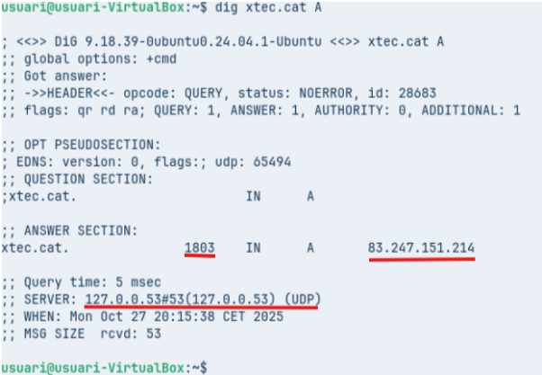
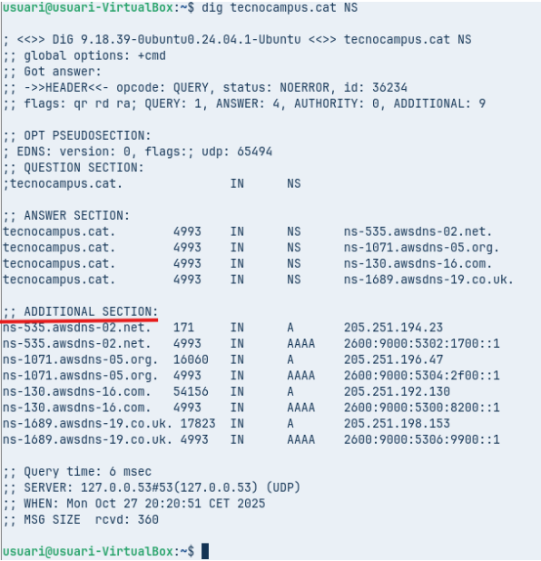
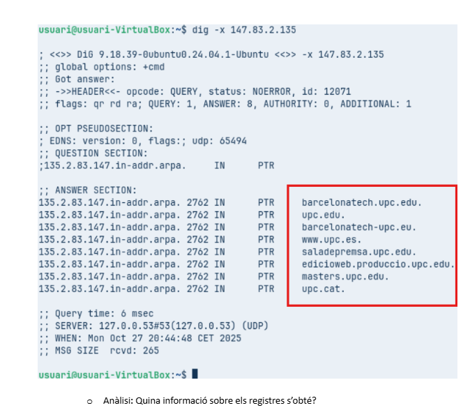
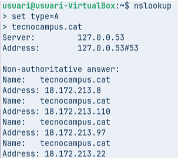
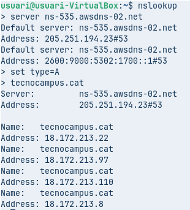

# T06: Fonaments del servei DNS (Part Pràctica)

## Comanda 1: Consulta Bàsica de Registre A
Executa `dig xtec.cat A`

**Anàlisi:** Identifica la IP de resposta, el valor TTL i el servidor que ha respost a la consulta.

- Valor TTL: `1803`  
- La IP de resposta és: `83.247.151.214`  
- La IP que ha respost la consulta és: `127.0.0.53`

---

## Comanda 2: Consulta de Servidors de Noms (NS)
Executa `dig tecnocampus.cat NS`

**Anàlisi:** Quins són els servidors de noms autoritatius per a aquest domini?

Són aquests:
- ns-535.awsdns-02.net.  
- ns-1071.awsdns-05.org.  
- ns-130.awsdns-16.com.  
- ns-1689.awsdns-19.co.uk.

---

## Comanda 3: Consulta Detallada SOA
Executa `dig escolapia.cat SOA`

**Anàlisi:** Quina és la informació del correu de l'administrador i el número de sèrie del domini?

- Correu de l’administrador: `dns1.nominalia.com.`  
- Número de sèrie del domini: `1761028965`

---

## Comanda 4: Consulta resolució inversa
Executa comanda `dig -x 147.83.2.135`

**Anàlisi:** Quina informació sobre els registres s’obté?  
Ens diu que són registres **PTR** i aquesta IP està en diferents dominis.

---

## Comprovació de Resolució amb nslookup (Multiplataforma)

L’eina `nslookup` es troba a pràcticament qualsevol sistema operatiu.  
Es pot usar de forma similar a `dig` incloent l’argument o, si s’executa `nslookup` sense arguments, entra en el mode interactiu (apareix el prompt `>`).  
Serà aquest mode el que explorareu.

El mode és força senzill, bàsicament hi ha tres comandes a usar:

set type= → per indicar el tipus de consulta: A, AAA, MX, NS, SOA, TXT o ALL
server IP → on IP és la IP del servidor de noms al que es vol fer la consulta (també es pot indicar el nom del servidor, p. ex. server a9-66.akam.net.)
exit → per sortir de la comanda

## Comanda 1: Consulta Bàsica no Autoritativa
Seleccionar `type=A` i com a domini de consulta `tecnocampus.cat`

**Anàlisi:** Per què indica que la resposta és no autoritativa?

Perquè el servidor DNS que ha respost la comanda és **no autoritatiu**, per tant la informació proporcionada **no deriva directament del domini** i no pot confirmar si és correcta.

---

## Comanda 2: Consultes autoritatives
Escriure `server IP` i escriure la IP del primer servidor de noms del domini `tecnocampus.cat` obtingut d’una consulta anterior.  
A continuació, indiqueu que voleu consultar registres de tipus `A` i del domini `tecnocampus.cat`.

**Anàlisi:** Quines diferències s’observen a la resposta obtinguda amb la comanda 1?

La primera resposta és **no autoritativa**, ja que la informació prové del DNS local i no és proporcionada directament del domini, mentre que la segona resposta és **autoritativa**, ja que la consulta s’ha fet directament al domini.
